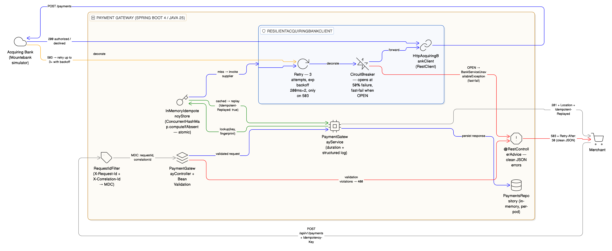

# 💳 Payment Gateway

A small but production-minded payment gateway built on **Spring Boot 4** and **Java 25**.
It accepts merchant payment requests, talks to an acquiring bank, and returns a clean,
idempotent response — with retries, a circuit breaker, structured logging and end-to-end
correlation built in.

---

## 🧰 Tech stack

| Concern              | Choice                                                    |
|----------------------|-----------------------------------------------------------|
| Language / Runtime   | Java 25 (toolchain), JVM 25                               |
| Framework            | Spring Boot 4.0.0, Spring Web 7                           |
| HTTP client          | `RestClient` over JDK `HttpClient` (timeouts configured)  |
| Resilience           | Resilience4j 2.4.0 — `Retry` + `CircuitBreaker`           |
| Validation           | Jakarta Bean Validation                                   |
| Boilerplate          | Lombok                                                    |
| API docs             | springdoc-openapi (Swagger UI)                            |
| Observability        | Spring Actuator + Micrometer + Prometheus endpoint        |
| Build                | Gradle 9 (wrapper included)                               |
| Bank simulator       | Mountebank imposter (`docker-compose.yml`)                |
| Tests                | JUnit 5, Mockito, AssertJ, MockMvc — **64 tests**         |

---

## 🚀 Quick start

```bash
# 1. Start the acquiring-bank simulator (Mountebank on :8080)
docker compose up -d

# 2. Run the gateway (on :8090)
./gradlew bootRun

# 3. Run the test suite
./gradlew test
```

- API: `http://localhost:8090/api/v1/payments`
- Swagger UI: `http://localhost:8090/swagger-ui/index.html`
- Actuator health: `http://localhost:8090/actuator/health`
- Prometheus scrape: `http://localhost:8090/actuator/prometheus`

### 🃏 Test cards (from the Mountebank simulator)
| Last digit of card # | Bank response |
|---|---|
| odd (1, 3, 5, 7, 9) | `200 authorized=true`  → **Authorized** |
| even (2, 4, 6, 8)   | `200 authorized=false` → **Declined**   |
| `0`                 | `503 Service Unavailable` → **503 to merchant** (after retries) |

### 🧪 Verified end-to-end (2026-04-23)

All eight live scenarios — authorize, idempotent replay, GET-back, decline, bank 503,
breaker trip, validation rejection, correlation-id propagation — pass against the
running gateway + Mountebank simulator. The most telling number: **bank-failure latency
collapses from ~640 ms → ~3 ms once the circuit breaker opens.**

Full request/response bodies, latency table per call and assertions are in
**[`docs/TESTING.md`](docs/TESTING.md)**.

---

## 🗺️ Architecture at a glance



Three flows to read off the picture:

1. **Happy path** (gray → blue → blue → gray)
   `Merchant → RequestIdFilter → Controller → Service → Idempotency miss → ResilientAcquiringBankClient → Bank → PaymentsRepository → Merchant`.
2. **Idempotent replay** (the dashed green edge from `InMemoryIdempotencyStore` back to the service)
   Same `Idempotency-Key` re-arrives → store returns the cached response, the bank is **not** invoked again.
3. **Bank failure** (orange dashed retry loop, then red)
   Bank returns 503 → `Retry` re-invokes up to 3× with exponential backoff → repeated failures feed the `CircuitBreaker` → once OPEN, calls fast-fail with `BankServiceUnavailableException` → the merchant gets a clean `503 + Retry-After: 30`, never a stack trace.

<details>
<summary>📐 Eraser.io source (paste into <a href="https://app.eraser.io">eraser.io</a> to re-render or edit)</summary>

```text
title Payment Gateway — Request Lifecycle (Idempotency, Retry, Circuit Breaker)

Merchant [icon: shopping-cart, label: "Merchant"]

Gateway [icon: server, label: "Payment Gateway (Spring Boot 4 / Java 25)"] {
  Filter [icon: tag, label: "RequestIdFilter (X-Request-Id + X-Correlation-Id → MDC)"]
  Controller [icon: layers, label: "PaymentGatewayController + Bean Validation"]
  Service [icon: cpu, label: "PaymentGatewayService (duration + structured log)"]
  Idempotency [icon: key, label: "InMemoryIdempotencyStore (ConcurrentHashMap.computeIfAbsent — atomic)"]
  Resilient [icon: shield, label: "ResilientAcquiringBankClient"] {
    Retry [icon: rotate-cw, label: "Retry — 3 attempts, exp backoff 200ms×2, only on 503"]
    Breaker [icon: zap-off, label: "CircuitBreaker — opens at 50% failure, fast-fail when OPEN"]
    Http [icon: link, label: "HttpAcquiringBankClient (RestClient)"]
  }
  Repo [icon: database, label: "PaymentsRepository (in-memory, per-pod)"]
  Errors [icon: alert-octagon, label: "@RestControllerAdvice — clean JSON errors"]
}

Bank [icon: cloud, label: "Acquiring Bank (Mountebank simulator)"]

Merchant > Filter: POST /api/v1/payments + Idempotency-Key [color: gray]
Filter > Controller: MDC: requestId, correlationId [color: gray]
Controller > Errors: validation violations → 400 [color: red, style: dashed]
Controller > Service: validated request [color: blue]
Service > Idempotency: lookup(key, fingerprint) [color: green]
Idempotency > Service: cached → replay (Idempotent-Replayed: true) [color: green, style: dashed]
Idempotency > Resilient: miss → invoke supplier [color: blue]
Resilient > Retry: decorate [color: blue]
Retry > Breaker: decorate [color: blue]
Breaker > Http: forward [color: blue]
Http > Bank: POST /payments [color: blue]
Bank > Http: 200 authorized / declined [color: blue]
Bank > Retry: 503 → retry up to 3× with backoff [color: orange, style: dashed]
Breaker > Errors: OPEN → BankServiceUnavailableException (fast-fail) [color: red, style: dashed]
Service > Repo: persist response [color: blue]
Service > Merchant: 201 + Location + Idempotent-Replayed [color: gray]
Errors > Merchant: 503 + Retry-After: 30 (clean JSON) [color: red]
```

</details>

---

## ✅ Practices currently in place

### Correctness & API hygiene
- Strict Jakarta validation on every field (PAN length, CVV format, currency allow-list,
  expiry-in-the-future, positive amount).
- Card number and CVV are **never** returned, persisted, or logged. Responses expose only
  `card_number_last_four`. Lombok `@ToString(exclude = {cardNumber, cvv})` on every DTO
  that carries them.
- Centralised `@RestControllerAdvice` returns consistent JSON errors with stable codes
  (`VALIDATION_FAILED`, `MALFORMED_REQUEST`, `ACQUIRING_BANK_SERVICE_UNAVAILABLE`, …).

### Idempotency
- Optional `Idempotency-Key` header on `POST /payments`.
- Atomic check-then-store via `ConcurrentHashMap.computeIfAbsent` — duplicate calls
  hit the bank **exactly once**.
- Same key + different body → `422 IDEMPOTENCY_KEY_REUSED` (request fingerprint mismatch).
- Failed bank calls are **not** cached — a retry with the same key can still succeed.
- Replays return the original response with `Idempotent-Replayed: true`.

### Resilience (Resilience4j, programmatic API)
- **Retry** — max 3 attempts, exponential backoff (200 ms × 2), retries **only** on
  `BankServiceUnavailableException` (bank 503 / network unreachable). Other errors fail fast.
- **Circuit breaker** — opens at 50 % failure rate over a sliding window of 20,
  half-open with 3 probe calls, 30 s open state. While open the call fast-fails and the
  merchant gets a clean `503` with `Retry-After: 30` — never a stack trace.
- All knobs are configurable under `gateway.acquiring-bank.resilience.*`.

### Observability
- `X-Request-Id` (per HTTP hop) and `X-Correlation-Id` (end-to-end journey) accepted
  from the client; generated UUIDs if absent. Both echoed back in the response and
  pushed into the SLF4J MDC.
- Log pattern: `[req=<requestId> corr=<correlationId>]` on every line.
- Structured transaction summary per payment: `id`, `status`, `replayed`, `durationMs`.
- Failures logged once, at the right level, in the right layer (no double-log noise).
- Resilience4j retry / breaker state transitions logged at `WARN`.

### Testing
- 64 tests covering: validation matrix, idempotency (incl. concurrency), card masking,
  CVV-not-stored guarantee, three bank scenarios (authorized / declined / 503),
  correlation header propagation, retry & circuit-breaker behaviour.
- Per-suite breakdown, phase-to-test coverage map and live e2e run results live in
  **[`docs/TESTING.md`](docs/TESTING.md)**.

---

## 🚢 What we'd still want before going to production

This repo is a solid core, but a real PSP needs more before it carries traffic.
Roughly in priority order:

### 🔐 Security & compliance (must-haves)
- **Tokenisation** — replace the PAN with a token at the edge so the gateway core
  never sees raw card data. Required to stay outside PCI-DSS scope.
- **mTLS / signed requests** between the gateway and the acquiring bank.
- **AuthN/AuthZ for merchants** — API keys or OAuth client credentials, per-merchant
  rate limits, audit logging of who called what.
- **Lock down `/actuator/**`** — currently exposes health/metrics/prometheus to anyone.
  Put behind auth or bind to an internal-only port.
- **Secret management** — bank URL/credentials/JWT keys via Vault / AWS Secrets Manager,
  not `application.properties`.
- **PCI-grade audit log** — separate append-only sink, redacted, retained per policy.

### 🗄️ Persistence & state
- Replace the in-memory `PaymentsRepository` and `InMemoryIdempotencyStore` with
  PostgreSQL (or DynamoDB) — current state is lost on restart and not shared across pods.
- Idempotency records should have a TTL (e.g. 24 h) and be unique-indexed on the key.

### 📈 Observability (uplift)
- Add `resilience4j-micrometer` so retry counts / breaker state / call latencies show
  up in Prometheus and Grafana dashboards.
- W3C tracing (`traceparent`) via Micrometer Tracing + OpenTelemetry — replaces our
  bespoke `X-Correlation-Id` with an industry-standard, vendor-neutral trace context.
- Ship logs to a central store (Loki / ELK) in JSON, not plain text.
- SLOs and alerts: p99 latency, bank failure rate, breaker-open events.

### 🛡️ Hardening
- Bulkheads / global rate limit (Bucket4j or a sidecar like Envoy).
- Request body size limits and timeouts at the edge.
- Graceful shutdown is on — verify with a pod-eviction drill.
- Dead-letter handling for partial-failure cases (bank ack lost, gateway killed mid-write).

### 🚀 Delivery
- Containerise: a multi-stage Dockerfile, distroless base, `USER nonroot`.
- CI: build + test + container scan + SBOM on every PR.
- Deploy: Kubernetes with HPA, PodDisruptionBudgets, readiness/liveness probes wired
  to `/actuator/health/{readiness,liveness}` (already enabled).
- Blue/green or canary releases — payments traffic shouldn't migrate in one shot.
- Chaos testing: kill the bank, drop the network, watch the breaker open and recover.

### 🧪 Testing (uplift)
- Real integration test against the Mountebank imposter (we currently mock the client).
- Contract tests (Pact) with the acquiring bank.
- Load + soak tests; verify idempotency under high concurrency on the persistent store.

---

## 📈 Scaling & multi-pod — the honest caveats

The current `ConcurrentHashMap`-backed `InMemoryIdempotencyStore` and `PaymentsRepository`
are **per-JVM**. They are correct for one pod and **silently wrong** for many — two pods
behind a load balancer would each accept the same `Idempotency-Key`, both call the bank,
and the customer gets charged twice. Same problem for `GET /payments/{id}` (pod A wrote it,
pod B doesn't know it).

What changes for a real multi-pod deployment:

| Concern             | Today (single pod)              | Multi-pod target                                                     |
|---------------------|---------------------------------|----------------------------------------------------------------------|
| Idempotency store   | `ConcurrentHashMap`             | Postgres `UNIQUE(idempotency_key)` + `INSERT … ON CONFLICT` (preferred), or Redis `SET NX` |
| Payments store      | In-memory map                   | Postgres (`PaymentsRepository` becomes a JDBC impl)                  |
| Circuit breaker     | Per-pod Resilience4j            | Per-pod is OK at small scale; at large scale push into the service mesh (Envoy/Istio) for cluster-wide breaking |
| Retry policy        | Per-pod                         | Per-pod is fine — independent retries are usually desirable          |

The good news: `IdempotencyStore` is already an **interface**, so the swap is
"write `JdbcIdempotencyStore` and rebind the bean" — no business-logic changes.

### How we'd scale it

- **Vertical:** more CPU, tune `server.tomcat.threads.max`, tune the JDK `HttpClient`
  connection pool, consider ZGC if latency-sensitive.
- **Horizontal:** stateless pods (after externalising state) + Kubernetes HPA on CPU
  and a custom Prometheus metric (RPS or p99). Minimum 3 pods across AZs.
- **Read scaling:** Postgres read replica for `GET /payments/{id}`.
- **Fairness:** per-merchant rate limit (Bucket4j or an Envoy sidecar).
- **Architectural:** split into an **ingress** service (validate + idempotency check,
  responds synchronously) and a **processor** service (talks to the bank, async, via
  Kafka). Decouples merchant-facing latency from bank latency and gives you natural
  retry / DLQ semantics. Shard by merchant id so idempotency lookups stay local.

---

## 🗂️ Project layout

```
src/main/java/com/checkout/payment/gateway/
├── client/          # AcquiringBankClient + HTTP impl + resilient decorator
├── configuration/   # Spring config + properties
├── controller/      # REST controller
├── exception/       # Domain exceptions + global handler
├── idempotency/     # Idempotency store + fingerprinting
├── mapper/          # DTO ↔ domain mapping
├── model/           # Request / response DTOs
├── repository/      # In-memory payments store
├── service/         # PaymentGatewayService (business flow)
└── web/             # RequestIdFilter (request-id + correlation-id)
imposters/           # Mountebank bank simulator config (do not change)
docker-compose.yml   # Spins up the bank simulator
```

---

## 📚 API at a glance

| Method | Path                       | Description                                  |
|--------|----------------------------|----------------------------------------------|
| POST   | `/api/v1/payments`         | Submit a payment (supports `Idempotency-Key`) |
| GET    | `/api/v1/payments/{id}`    | Fetch a previously processed payment         |

Full request/response schemas live in Swagger UI:
**http://localhost:8090/swagger-ui/index.html**
